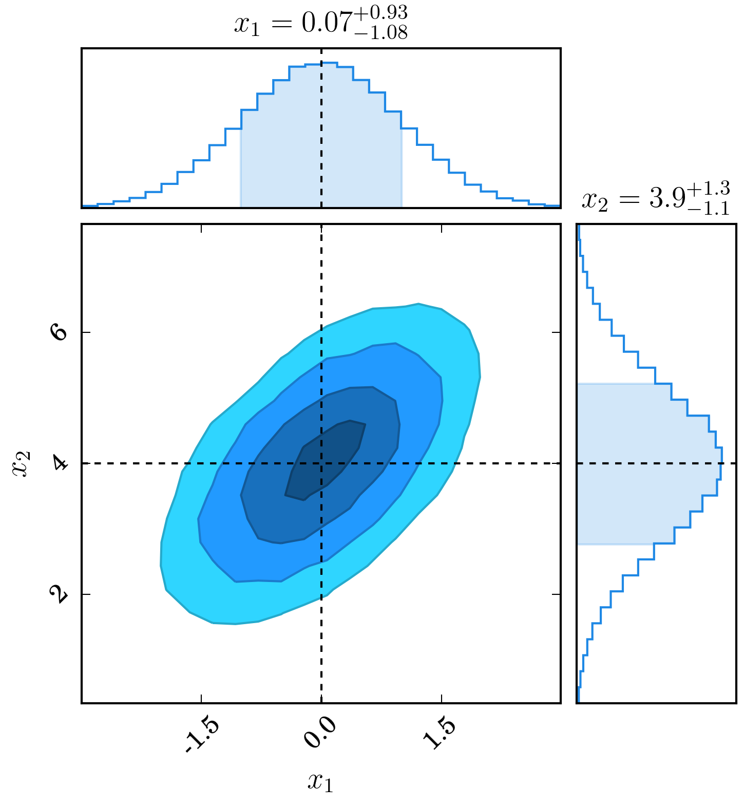

# ChainConsumer

A new library to consume your fitting chains! Produce likelihood surfaces,
plot your walks to check convergence, or even output a LaTeX table of the
marginalised parameter distributions with uncertainties and significant
figures all done for you!

