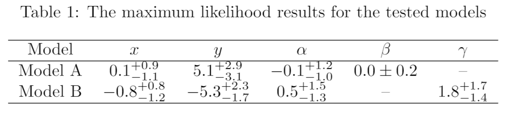

# [ChainConsumer](https://samreay.github.io/ChainConsumer)

[](https://travis-ci.org/Samreay/ChainConsumer)
[](https://coveralls.io/github/Samreay/ChainConsumer?branch=master)
[](https://github.com/dessn/abc/blob/master/LICENSE)
[](https://pypi.python.org/pypi/ChainConsumer)
[](https://zenodo.org/badge/latestdoi/23430/Samreay/ChainConsumer)

A new library to consume your fitting chains! Produce likelihood surfaces,
plot your walks to check convergence, or even output a LaTeX table of the
marginalised parameter distributions with uncertainties and significant
figures all done for you!

[Click through to the online documentation](https://samreay.github.io/ChainConsumer)

```python
import numpy as np
from chainconsumer import ChainConsumer

mean = [0.0, 4.0]
data = np.random.multivariate_normal(mean, [[1.0, 0.7], [0.7, 1.5]], size=100000)

c = ChainConsumer()
c.add_chain(data, parameters=["$x_1$", "$x_2$"])
c.plot(filename="example.png", figsize="column", truth=mean)
```


You can plot walks:

```
c.plot_walks(filename="walks.png")
```


And finally, you can also create LaTeX tables:

```
print(c.get_latex_table())
```

Which compiles to something as shown below:



-----------


Install via `pip`:
    
    pip install chainconsumer


----------

Please feel free to fork the project and open pull-requests, or
raise an issue via Github if any bugs are encountered or 
features requests thought up.

### Update History

##### 0.9.2
* Adding in smoothing, making it default
* Adding extra example to show how to remove smoothing.

##### 0.9.1
* Adding in tests

##### 0.9.0
* Initial PyPi push