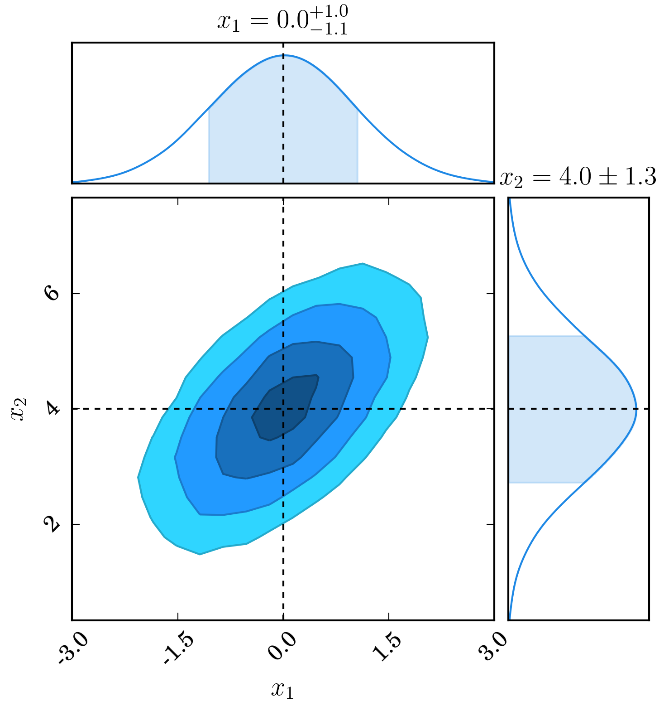
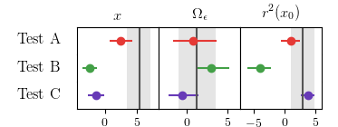

=============
ChainConsumer
=============

ChainConsumer is a python package designed to do one thing - consume the chains
output from Monte Carlo processes like MCMC. ChainConsumer can utilise these chains
to produce plots of the posterior surface inferred from the chain distributions,
to plot the chains as walks (to check for mixing and convergence), and to output
parameter summaries in the form of LaTeX tables. On top of all of this,
if you have multiple models (chains), you can load them all in and perform some
model comparison using AIC, BIC or DIC metrics.

To get things started, here is a basic example:

.. code-block:: python

    import numpy as np
    from chainconsumer import ChainConsumer

    mean = [0.0, 4.0]
    data = np.random.multivariate_normal(mean, [[1.0, 0.7], [0.7, 1.5]], size=100000)

    c = ChainConsumer()
    c.add_chain(data, parameters=["$x_1$", "$x_2$"])
    c.plotter.plot(filename="example.png", figsize="column", truth=mean)

The output figure is displayed below.

Or you can add more models and look at the summaries between them. Or a ton more, check the examples!

Check out the API and far more :ref:`examples-index` below:

Contents
--------

.. toctree::
   :maxdepth: 2

   usage
   examples/index
   chain_api

Installation
------------

ChainConsumer requires the following dependencies, along with a LaTeX installation and `dvipng` (a maptlotlib dependency)::

    numpy
    scipy
    matplotlib
    statsmodels

ChainConsumer can be installed as follows::

    pip install chainconsumer

Common Issues
-------------

Users on some Linux platforms have reported issues rendering plots using ChainConsumer.
The common error states that `dvipng: not found`, and as per `StackOverflow <http://stackoverflow.com/a/32915992/3339667>`_
post, it can be solved by explicitly install the `matplotlib` dependency `dvipng` via `sudo apt-get install dvipng`.

Citing
------

You can cite ChainConsumer using the following BibTeX::

   @ARTICLE{Hinton2016,
      author = {{Hinton}, S.~R.},
       title = "{ChainConsumer}",
     journal = {The Journal of Open Source Software},
        year = 2016,
       month = aug,
      volume = 1,
         eid = {00045},
       pages = {00045},
         doi = {10.21105/joss.00045},
      adsurl = {http://adsabs.harvard.edu/abs/2016JOSS....1...45H},
   }

Contributing
------------

Users that wish to contribute to this project may do so in a number of ways.
Firstly, for any feature requests, bugs or general ideas, please raise an issue
via `Github <https://github.com/samreay/ChainConsumer/issues>`_.

If you wish to contribute code to the project, please simple fork the project on
Github and then raise a pull request. Pull requests will be reviewed to determine
whether the changes are major or minor in nature, and to ensure all changes are tested.